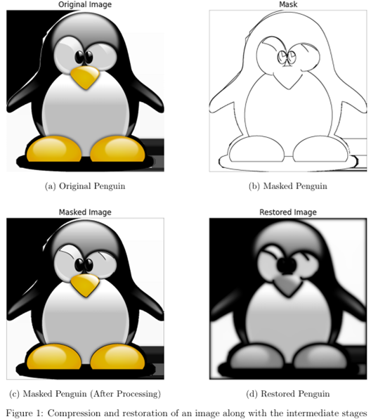
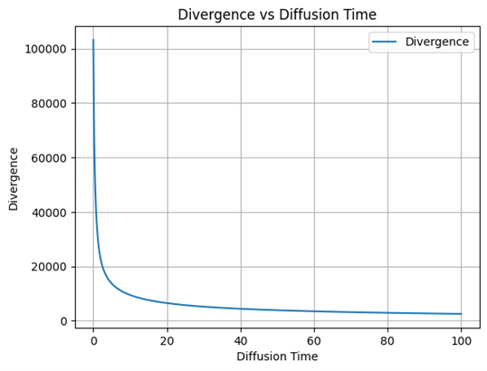

# Image Compression and Restoration

This repository contains two projects related to image compression techniques:
1. **JPEG Compression Engine**: A custom implementation inspired by the JPEG compression algorithm.
2. **Edge-Based Image Compression**: An implementation of a research paper that employs edge detection and homogeneous diffusion for image compression.

[Click here](CS663_Project_Report.pdf) for the detailed project report summarizing the methods, experiments, and results.

---

## Repository Contents
- **`JPEG_compression_engine.ipynb`**: Implements a JPEG-like compression algorithm.
- **`Research_Paper_Implementation.ipynb`**: Implements edge-based image compression from a research paper ([link to paper](https://projet.liris.cnrs.fr/imagine/pub/proceedings/CAIP-2009/papers/5702/57020476.pdf)).
- **`CS663_Project_Report.pdf`**: Comprehensive report detailing methodologies, experiments, and results of both projects.

---

## Features

### 1. JPEG Compression Engine
  
- **Techniques Used**:
  - **Discrete Cosine Transform (DCT)**: Converts image data from spatial to frequency domain.

$$ C(u, v) = \frac{1}{\sqrt{2N}} \sum_{x=0}^{N-1} \sum_{y=0}^{N-1} I(x, y) \cos \left( \frac{\pi(2x+1)u}{2N} \right) \cos \left( \frac{\pi(2y+1)v}{2N} \right) $$

where:
- $I(x, y)$ represents the intensity value of the pixel at position $(x, y)$ in the image block.
- $C(u, v)$ is the DCT coefficient at position $(u, v)$ in the frequency domain.
- $N$ is the size of the block ($N=8$ in JPEG compression).
- The $u$ and $v$ indices correspond to frequencies in the horizontal and vertical directions, respectively.


  - **Quantization**: Reduces precision for compression.
    
$$ Q(u, v) = \text{round}\left(\frac{C(u, v)}{Q_{\text{table}}(u, v)}\right) $$

where:
- $C(u, v)$ represents the DCT coefficient at position $(u, v)$,
- $Q_{\text{table}}(u, v)$ is the corresponding value in the quantization matrix,
- $Q(u, v)$ is the quantized coefficient.


  - **Huffman Encoding**: Entropy coding for efficient data representation.
  
- **Objectives**:
  - Implement core JPEG compression steps for grayscale images.
  - Evaluate compression with metrics such as **Bits Per Pixel (BPP)** and **Root Mean Squared Error (RMSE)**.
  - Simulate varying quality factors and plot **RMSE vs. BPP** curves.
- **Sample Results**:
  
  
  
| **Quality Factor** | **File Size (bytes)** | **Compression Rate** | **Compression Ratio** |
|--------------------|-----------------------|----------------------|-----------------------|
| Original           | 186368                | -                    | -                     |
| 10                 | 3116.50               | 59.80                | 0.017                 |
| 40                 | 3932.88               | 47.39                | 0.021                 |
| 80                 | 4967.62               | 37.52                | 0.027                 |

*Table 1: File Size, Compression Rate, and Compression Ratio at different Quality Factors*


### 2. Edge-Based Image Compression
- **Stages**:
  - **Edge Detection and Mask Generation**: Identifies edges for efficient compression.
  - **Subsampling**: Reduces redundant data storage near edges.
  - **Supersampling**: Improves reconstruction near edges.
  - **Reconstruction**: Uses homogeneous diffusion to fill missing data.
- **Sample Results**:  
    
  
  
---

## Installation and Usage

### Prerequisites
- Python 3.8 or above
- Required libraries:
  - `numpy`
  - `opencv-python`
  - `scipy`
  - `matplotlib`
  - `jupyterlab`

Install dependencies using:
```bash
pip install numpy opencv-python scipy matplotlib jupyterlab
```

### Execution
Clone the repository:
```bash
git clone https://github.com/SRAVAN-IITB/Image-Compression-Algorithms.git
cd Image-Compression-Algorithms
```

Run the notebooks:
1. Open `JPEG_compression_engine.ipynb` or `Research_Paper_Implementation.ipynb` in Jupyter Lab/Notebook.
2. Execute cells sequentially to see results and visualizations.

## Results and Analysis

### JPEG Compression
- Significant compression achieved with minimal loss in visual quality.
- Observed inverse exponential decay of RMSE with increasing BPP.

### Edge-Based Compression
- Moderate compression rates with limitations in Peak Signal-to-Noise Ratio (PSNR) for detailed images.
- For detailed analysis, refer to `CS663_Project_Report.pdf`.

## Contributions
Feel free to contribute by opening issues or submitting pull requests. Feedback is highly appreciated!

## Acknowledgments
- Prof. Ajit Rajwade, Indian Institute of Technology Bombay.
- Research paper authors for their innovative methods in image compression.
- Libraries: NumPy, OpenCV, SciPy, and Matplotlib.

## License
This project is licensed under the MIT License. See the LICENSE file for details.

---

